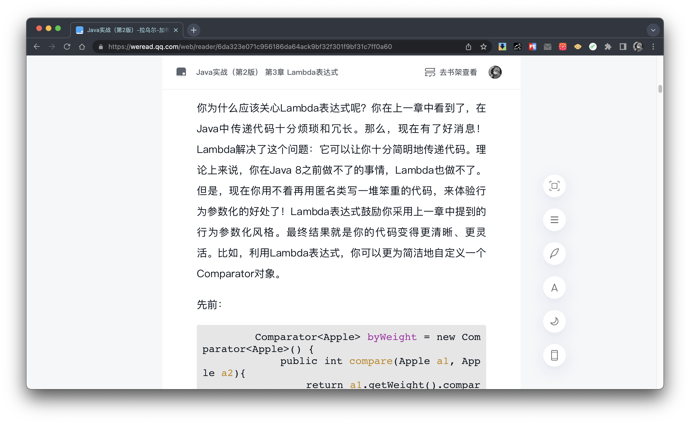
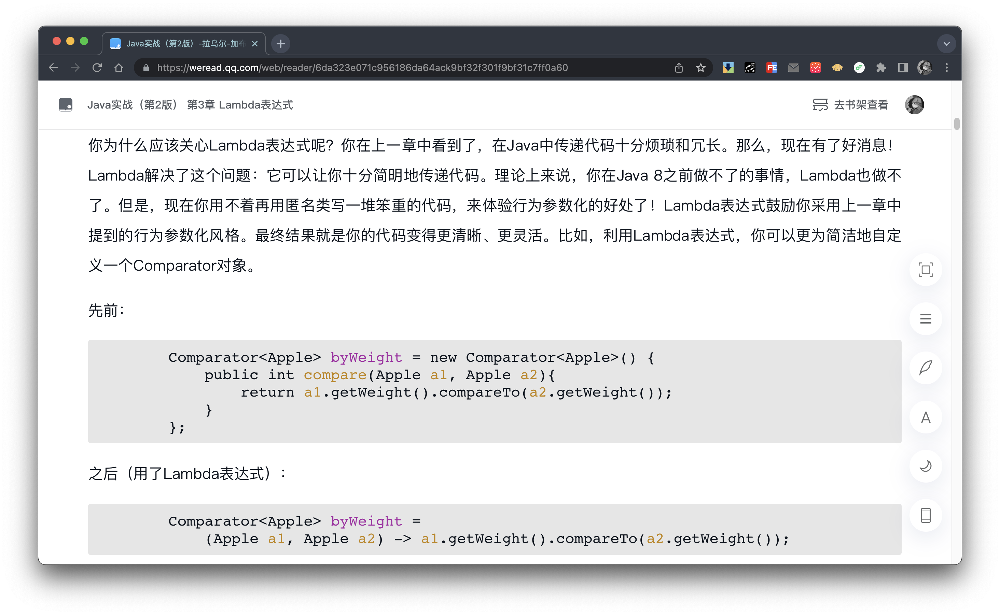

# 微信读书 Web 端工具箱（Chrome 插件）

## 功能

- 网页全屏（阅读页面工具栏提供全屏按钮，实现全屏阅读，展示更多内容）

|       全屏前        |       全屏后        |
| :-----------------: | :-----------------: |
|  |  |

- 书签管理（待开发）

- 同步移动端分类信息（待开发）

- 。。。

## 使用

> 该插件暂时未上架 chrome 网上应用店

1. 下载本项目（若是压缩文件，需解压）
2. 使用 chrome 浏览器打开“管理扩展程序页”（或地址栏输入“chrome://extensions/”直接打开）
3. 打开“开发者模式”
4. 点击“加载已解压的扩展程序”
5. 选择本项目即可

